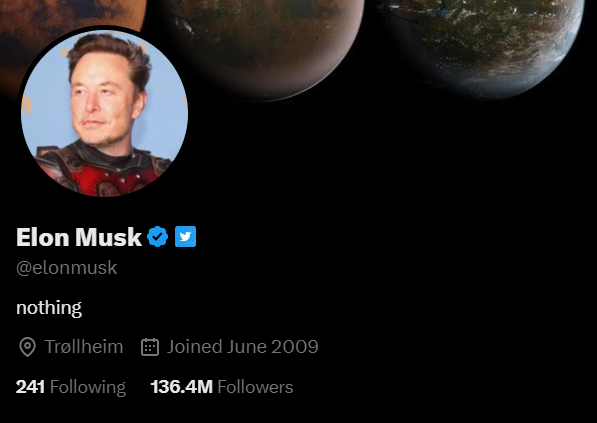
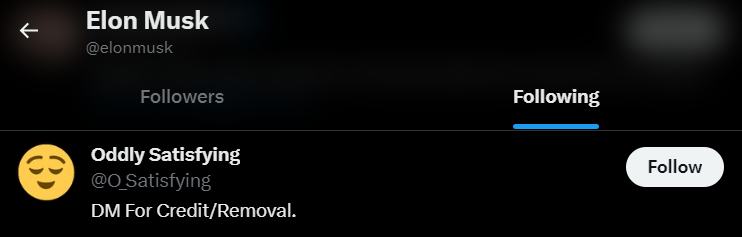

# Crawl Twitter Social Networks using the Twitter API v2 with Tweepy and Python.

<p align="left">
    
</p>

### Table of contents:
* [:star: Introduction](#star-introduction)
* [:key: Prerequisites](#key-prerequisites)
* [:book: Dependencies](#book-dependencies)
* [:gear: Configure the crawler](#gear-configure-the-crawler)
* [:mag: Build queries](#mag-build-queries)
* [:arrow_forward: Run the crawler](#arrow_forward-run-the-crawler)
* [:eyes: View the crawler output](#eyes-view-the-crawler-output)

-----------------------------------------------------------

## :star: Introduction
This repository contains a Twitter crawler that is able to crawl the following data using Twitter API v2 with the Tweepy library and Python:
* User profile (e.g., name, profile description, following count, follower count, tweet count, etc.)
* Tweet content (e.g., text, author, hashtag, topic, etc.)
* Follow interactions
* Post interactions
* Retweet interactions
* Like interactions

-----------------------------------------------------------

## :key: Prerequisites
In order to work with Twitter API v2, you have to sign up for a developer account to get keys and tokens for Twitter API access. [Learn more about how to access the Twitter API](https://developer.twitter.com/en/docs/twitter-api/getting-started/getting-access-to-the-twitter-api)

1. Sign up for a [Twitter developer account](https://developer.twitter.com).
2. Create a Project and App.
3. Find or generate the following credentials within your developer App:
    * Consumer Key and Secret
    * Access Token and Secret
    * Bearer Token

Basically, Twitter allows you to access tweets from the last 7 days only. If you would like to access the full archive of tweets, *Academic Research access* is required. [Learn more about Acedemic Research access](https://developer.twitter.com/en/products/twitter-api/academic-research)

-----------------------------------------------------------

## :book: Dependencies
The script is implemented under the following dependencies:
* `tweepy==4.13.0`
* `pandas==2.0.0`
* `omegaconf==2.3.0`
* `tqdm==4.65.0`

Install all dependencies:
```bash
pip install -r requirements.txt
```

-----------------------------------------------------------

## :gear: Configure the crawler
You can manage configuration at `config.yaml`.

1. Specify whether you have Academic Research access.
```yaml
ACADEMIC_ACCESS: True
```

2. Place your credentials.
```yaml
# Place your credentials.
CONSUMER_KEY: "<REPLACE ME>"
CONSUMER_SECRET: "<REPLACE ME>"
ACCESS_TOKEN: "<REPLACE ME>"
ACCESS_SECRET: "<REPLACE ME>"
BEARER_TOKEN: "<REPLACE ME>"
```

3. Specify your base query, tweet field, user field, time period, and crawling limit.

-----------------------------------------------------------

## :mag: Build queries
You can specify your queries in `query.json`. [Learn more about how to build queries](https://developer.twitter.com/en/docs/twitter-api/tweets/search/integrate/build-a-query)

* Ex: Searching for tweets that contain the keyword *"twitter"* from *"Elon Musk"*.
```json
[
    {
        "context": "",
        "keyword": "twitter",
        "user": "from:elonmusk"
    }
]
```

You can also search by a specific domain and entity. [Learn more about tweet annotations](https://developer.twitter.com/en/docs/twitter-api/annotations/overview) and [See all available domain and entity](https://github.com/twitterdev/twitter-context-annotations)  

* Ex: Searching for tweets within the *"Tech News"* domain that contain the hashtag *"#tech"* and one of *"#apple"* or *"#iphone"*.
```json
[
    {
        "context": "context:131.840160819388141570",
        "keyword": "#tech (#apple OR #iphone)",
        "user": ""
    }
]
```

-----------------------------------------------------------

## :arrow_forward: Run the crawler
You can run the crawler using the following command:
```bash
python crawler.py
```

<details>
<Summary> You can also parse arguments to the command:</Summary>

```bash
python crawler.py [--cfg] <config_file>
```
</details>

-----------------------------------------------------------

## :eyes: View the crawler output
Once crawling is finished, the following `.csv` files are created under the `./data` directory:

```
data
└─ tweet.csv
└─ user.csv
└─ follow.csv
└─ post.csv
└─ retweet.csv
└─ like.csv
```

Examples of crawler outputs:

* Examples of `tweet.csv`:

    <p align="left">
    
    </p>

    | id                  | author_id | text   |
    | ------------------: | --------: | -----: |
    | 1649919766742614017 | 44196397  | 'The least bad solution to the AGI control problem that I can think of is to give every verified human a vote' |

* Examples of `user.csv`:

    <p align="left">
    
    </p>

    | id       | name      | username | description | verified | followers_count | following_count | tweet_count |
    | -------: | --------: | -------: | ----------: | -------: | --------------: | --------------: | ----------: |
    | 44196397 | Elon Musk | elonmusk | nothing     | True     | 136395633       | 241             | 25051       |


* Examples of `follow.csv`:

    <p align="left">
    
    </p>

    | user_id   | following_id          |
    | --------: | --------------------: |
    | 44196397  | 797727562235609088    |


* Examples of `post.csv`, `retweet.csv`, and `like.csv`:

    | user_id   | tweet_id              |
    | --------: | --------------------: |
    | 44196397  | 1649919766742614017   |
